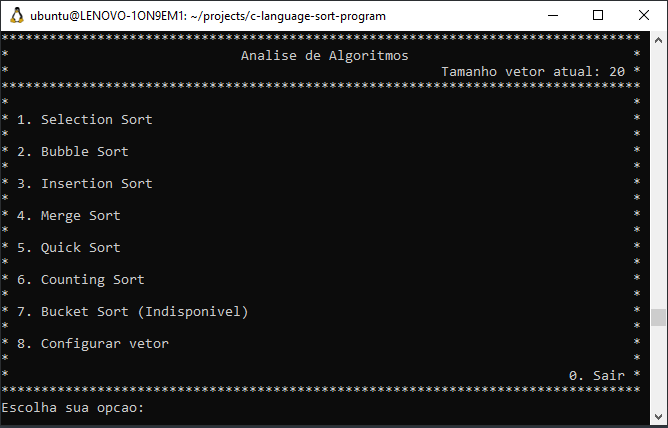
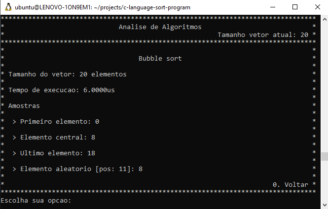
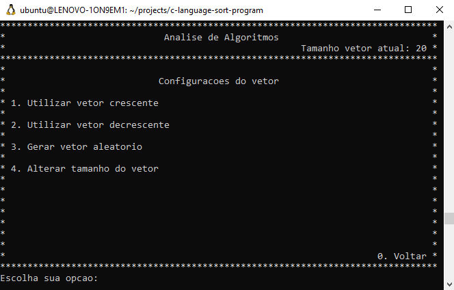
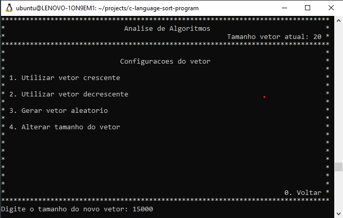
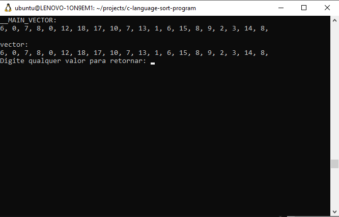

# C Language - Sort Program

This program contains some os the most common sort algorithms to present a simple way to switch between then and compare its performance in same vector.

It also allow you to configure your vector changing vector size, and generating it randomly, ascendent or descendent. You can see this screen in the printscreens down below.

## Compiling and running

You can build this system in any linux-based system using gcc in root folder, as follow:
```
$ gcc main.c -o SortProgram
```

This will create a new executable in the project root path named SortProgram (or SortProgram.exe on windows). Now you only need to run it:

For Linux/MAC users:

```
./SortProgram
```

For Windows users, just double click on executable program.

## How to use

It provides a simple interface to use oriented by option-action menu which consist in selecting a option by typing the number of the option, then pressing Enter key to confirm. The image below shows you the main menu screen.

## Hidden debug option

Some menus has a debug option which can be accessed by choosing a option 'd' event if it does not show in the valid options in menu options.

Some screens that contains it are: 
  - main menu screen
  - results screen
  - configuration screen


## Some screens

> ### Main menu:
>
> 

> ### Bubblesort result screen:
>
>

> ### Configuration screen:
>
>

> ### Choosing a new vector size:
>
>

> ### The debug screen:
>
>

## Authors

- **Nicolas Anelli** - [Github](https://github.com/NicolasAnelli).

### Considerations:

Feel free for forking this project, and submiting any improvement.

## License

MIT License

Copyright (c) 2021 Nicolas Anelli

Permission is hereby granted, free of charge, to any person obtaining a copy
of this software and associated documentation files (the "Software"), to deal
in the Software without restriction, including without limitation the rights
to use, copy, modify, merge, publish, distribute, sublicense, and/or sell
copies of the Software, and to permit persons to whom the Software is
furnished to do so, subject to the following conditions:

The above copyright notice and this permission notice shall be included in all
copies or substantial portions of the Software.

THE SOFTWARE IS PROVIDED "AS IS", WITHOUT WARRANTY OF ANY KIND, EXPRESS OR
IMPLIED, INCLUDING BUT NOT LIMITED TO THE WARRANTIES OF MERCHANTABILITY,
FITNESS FOR A PARTICULAR PURPOSE AND NONINFRINGEMENT. IN NO EVENT SHALL THE
AUTHORS OR COPYRIGHT HOLDERS BE LIABLE FOR ANY CLAIM, DAMAGES OR OTHER
LIABILITY, WHETHER IN AN ACTION OF CONTRACT, TORT OR OTHERWISE, ARISING FROM,
OUT OF OR IN CONNECTION WITH THE SOFTWARE OR THE USE OR OTHER DEALINGS IN THE
SOFTWARE.